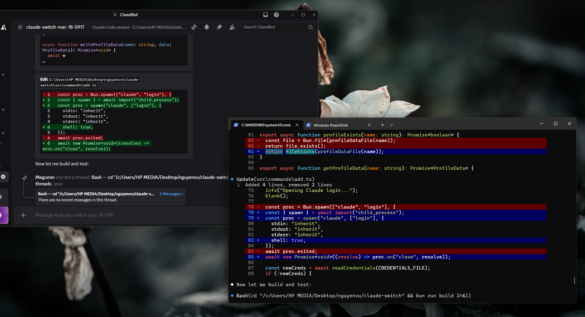

# claude-remote

Control Claude Code from your phone. It mirrors your terminal session to a Discord channel — you can read what Claude's doing, send messages, approve tool calls, attach images, all from Discord.

I built this because I kept kicking off long Claude tasks and then leaving my desk. Couldn't check progress or approve permissions without walking back to the terminal. Now I just check Discord.

## What it looks like



When enabled, each Claude session gets its own Discord channel. Messages, tool calls, diffs, and errors stream in as rich embeds. You interact through buttons and typing:

- Tool calls show up with Allow / Deny buttons
- File edits render as syntax-highlighted diffs
- Long outputs go into threads so the channel stays readable
- Tasks get a pinned board with a progress bar
- If Claude is busy, your messages queue up and execute in order

## Setup

You need Windows or Linux (macOS may work but is untested), Node 18+, and a Discord bot.

### Platform Support

- **Windows** — fully supported
- **Linux** — Ubuntu 22.04+, Fedora, Alpine 3.19+ (with extra build steps), WSL2
- **macOS** — untested but may work

If you run into issues on your distribution, consult `COMPATIBILITY.md` for guidance.

### Prerequisites

- **Node.js 18+** — use [nvm](https://github.com/nvm-sh/nvm) or your distro's package manager
- **Build tools** for native modules (`node-pty`):
  - Ubuntu/Debian: `sudo apt-get install -y build-essential python3`
  - Fedora: `sudo dnf groupinstall "Development Tools" && sudo dnf install -y python3`
  - Alpine: `sudo apk add build-base python3 linux-headers` (see COMPATIBILITY.md)
  - WSL2: same as Ubuntu
- **Git** and **curl**
- **Claude Code CLI** — install via:
  ```bash
  curl -fsSL https://claude.ai/install.sh | bash
  ```

### Creating the bot

1. [Discord Developer Portal](https://discord.com/developers/applications) → New Application → Bot tab → copy token
2. Enable **Message Content Intent** under Privileged Gateway Intents
3. OAuth2 → URL Generator → select `bot` scope → permissions: Send Messages, Manage Channels, Read Message History, Manage Threads
4. Open the URL to invite it to your server

### Install and configure

```bash
npm install -g @dacineu/claude-remote
claude-remote setup
```

Setup walks you through entering your bot token, picking your server, and installing the hooks/statusline into Claude Code. It can also set up a `claude` shell alias so you don't have to type `claude-remote` every time.

### Installation on Linux

After installing Node.js and build tools (see Prerequisites above), you can install `claude-remote` globally:

```bash
npm install -g @dacineu/claude-remote
```

This installs two binaries: `claude-remote` and `remote-cmd`.

**Alpine Linux** requires additional build dependencies; see `COMPATIBILITY.md` for full instructions.

#### Shell alias (optional)

You can set up a `claude` alias so you don't have to type `claude-remote` every time:

```bash
claude-remote setup
```

The setup wizard will offer to install the alias to your shell profile (`.bashrc`, `.zshrc`, or `config.fish`).

### Configuration

You can provide Discord credentials via environment variables or a `.env` file:

- **Environment variables:** `DISCORD_BOT_TOKEN`, `DISCORD_GUILD_ID`, `DISCORD_CATEGORY_ID`
- **`.env` file:** Place a `.env` file in the config directory (`~/.config/claude-remote/.env`) with those variables. Environment variables take precedence over the `.env` file.

This is useful for non-interactive setups or to avoid re-entering tokens.

### Troubleshooting

**`EACCES` or permission errors during global install**

If you get permission errors installing globally, use a user-local prefix:

```bash
npm install -g --prefix ~/.npm-global @hoangvu12/claude-remote
```

Then add `~/.npm-global/bin` to your `PATH`.

Alternatively, fix directory permissions or use `sudo` (not recommended for security).

**`claude` command not found**

Ensure your npm global bin directory is in your `PATH`. Common locations:

- `~/.npm-global/bin`
- `~/.local/bin`
- `/usr/local/bin`

Verify with:

```bash
which claude-remote
```

If not found, add the appropriate directory to your shell's `PATH` (e.g., in `~/.bashrc`): `export PATH="$HOME/.npm-global/bin:$PATH"`.

**Discord bot cannot read messages or manage channels**

Check that your bot has the required **Privileged Gateway Intents**:

- **Message Content Intent** — must be enabled in the Discord Developer Portal
- Bot permissions: Send Messages, Manage Channels, Read Message History, Manage Threads, **Embed Links**, **Attach Files**

**Socket permission errors (Linux)**

Socket files are created in `/tmp`. If you see permission errors, ensure you're running `claude-remote` as the same user that installed it. Avoid mixing `sudo` and user installs. The socket is created as `/tmp/claude-remote-<pid>.sock` and removed on exit.

**Claude binary not found**

If `claude` is not in your `PATH`, install it via the official install script or ensure `~/.local/bin` is in your `PATH` (the default install location for the Claude Code CLI on Linux).

## Usage

```bash
claude-remote            # starts Claude Code with the remote wrapper
claude-remote --resume   # all args pass through to claude
claude-remote -p "fix the login bug"
```

Toggle the Discord sync inside a session:

```
/remote               # toggle on/off
/remote on            # enable
/remote off           # disable
/remote on my-session # enable with a custom channel name
/remote status        # print current state
```

### Authorization

For security, each Discord remote session requires a one-time authorization. When you enable remote sync (`/remote on`), a 6-digit pairing code is displayed in your terminal. Enter this code using the `/auth` slash command in Discord to unlock control of the session. The code expires after 60 seconds and can only be used once.

If you need to re-authorize (e.g., after the code expires), simply restart the session with `/remote off` and `/remote on` to generate a new code.

### Discord commands

Once authorized, you can use the following slash commands in the channel:

| Command | What it does |
|---------|-------------|
| `/auth <code>` | Authorize using the pairing code from terminal |
| `/mode <mode>` | Switch permission mode |
| `/status` | Session info and current state |
| `/stop` | Interrupt Claude |
| `/clear` | Clear context, start fresh |
| `/compact [instructions]` | Trigger context compaction |
| `/queue view\|clear\|remove\|edit` | Manage queued messages |
| `/model <model>` | Switch Claude model |

You can also just type in the channel to send messages to Claude, or attach images. Buttons and select menus will appear for tool calls, file diffs, and task management — you can approve/deny directly from Discord.

**Note:** When the channel is created, a pinned message appears with usage instructions and available commands. Read it for quick reference.

**Slash Autocomplete Tip:** Discord's client shows a dropdown when you type `/`. To avoid this:
- Use `\/` to send a plain `/` (e.g., `\/usr\/bin` displays as `/usr/bin`)
- Use code blocks for code/JSON: `` `code` `` or ```` ``` ``` ````
- Or disable autocomplete: Settings → Text & Images → toggle "Autocomplete" off

## How it works

`claude-remote` spawns `claude.exe` in a PTY and runs a named pipe server alongside it. When you enable sync, a daemon process connects to Discord and starts tailing the JSONL session file that Claude writes to.

New lines get parsed and routed through a handler pipeline — different handlers deal with tool calls, file edits, tasks, plan mode, etc. Each handler decides whether to render inline or in a thread.

User input from Discord flows back through IPC to the PTY as simulated keystrokes.

```
Terminal                Named Pipe              Discord
+-----------+          +----------+            +----------+
| claude.exe| <-PTY-> | rc.ts    | <--fork--> | daemon.ts|
+-----------+          +----------+    IPC     +----------+
                            ^                       |
                            |                       v
                       JSONL watcher          Discord channel
                       (transcript)           (embeds, buttons)
```

## Provider abstraction

Discord is the only provider right now, but the codebase has a provider interface (`src/provider.ts`) so adding Telegram, Slack, etc. shouldn't require touching the core logic. PRs welcome if you want to take a crack at it.

## Uninstall

```bash
claude-remote uninstall
npm uninstall -g @dacineu/claude-remote
```

## Debugging

If you encounter issues, enable debug logging to get detailed diagnostics:

```bash
# Linux/macOS
DEBUG=claude-remote:* claude-remote -p "your prompt"

# Windows PowerShell
$env:DEBUG="claude-remote:*"; claude-remote -p "your prompt"
```

Debug output is sent to stderr and includes namespace-prefixed messages:

- `claude-remote:platform` — Platform detection, config dir, pipe path, shell profiles
- `claude-remote:rc` — Parent process: pipe server start/stop, daemon lifecycle, binary lookup
- `claude-remote:pipe-client` — Pipe discovery, connection attempts, timeouts
- `claude-remote:daemon` — Daemon startup, channel creation, JSONL watching, message batching

You can filter namespaces if needed, e.g. `DEBUG=claude-remote:rc,claude-remote:pipe-client`.

## License

MIT
